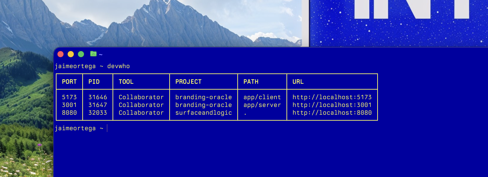

# devtools

Every time I got back to work I'd find mysterious localhost stuff still running. 

If I have to keep track of what's running and on which port, and then politely shut down everything I don't need for the day, forget it. I'm not doing that.

The usual answer is lsof minus something then ps fp then more stuff etc. I can't believe engineers live like this. Those words don't even make sense.

I just want to answer “what's running and where is it coming from?”

There are tools like pstree, but honestly they show way more than I need. I just wanted to take a quick look to see: which projects have active development servers, which tool started them, and a link to open them.

So instead I wrote three little shell functions. Elegant. Simple. Chef's kiss.

They're yours to use if you fancy.



## Commands

- **`devwho`** — One table with everything: port, process, which tool launched it (Claude, Collaborator, Cursor, Ghostty, tmux), project name, subfolder path, and a clickable localhost URL.
- **`devkill`** — Kill dev servers by port (`devkill 5173`), by project name (`devkill branding-oracle`), or pick from a list (`devkill`).
- **`devview`** — Raw `lsof` + `ps` dump for when you need the deeper look.

## Install

```sh
git clone https://github.com/JaimeOrtegaxyz/devtools.git ~/Documents/GitHub/devtools
cd ~/Documents/GitHub/devtools
bash install.sh
```

This copies `devtools.zsh` to `~/.devtools.zsh` and adds a small source block to `~/.zshrc`.

## Uninstall

```sh
cd ~/Documents/GitHub/devtools
bash uninstall.sh
```

## Updating

After editing `devtools.zsh` in the repo:

```sh
cp ~/Documents/GitHub/devtools/devtools.zsh ~/.devtools.zsh
source ~/.zshrc
```

Or just re-run `bash install.sh`.

## Customization

Edit `devtools.zsh` directly. Add tools, commands, or detection patterns as needed.
