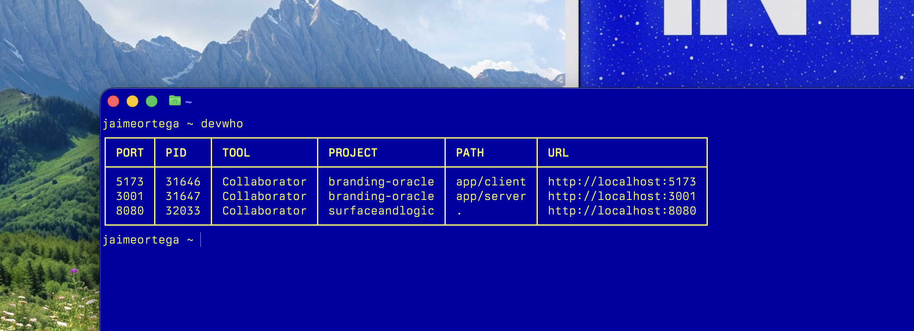

# devtools

Every time I got back to work I'd find mysterious localhost stuff still running. 

If I have to keep track of what's running and on which port, and then politely shut down everything I don't need for the day, forget it. I'm not doing that.

The usual answer is lsof minus something then ps fp then more stuff etc. I can't believe engineers live like this. Those words don't even make sense.

I just want to answer “what's running and where is it coming from?”

There are tools like pstree, but honestly they show way more than I need. I just wanted to take a quick look to see: which projects have active development servers, which tool started them, and a link to open them.

So instead I wrote three little shell functions. Elegant. Simple. Chef's kiss.

They're yours to use if you fancy.



## Commands

- **`devwho`** — One table of your project dev servers: port, process, tool (vite, astro, next, uvicorn…), project name, subfolder path, and a clickable localhost URL. Anything else listening — Raycast, Docker, an Electron app — is named in a dimmed **Other listeners** line below the table, so you can still answer "what's on :7265?" without mistaking it for yours.
- **`devkill`** — Kill dev servers by port (`devkill 5173`), by project name (`devkill branding-oracle`), or pick from a list (`devkill`). `all` kills your servers; `all!` also kills the other listeners, after showing you exactly which apps that means and asking for a typed `yes`. Aiming at an app's port directly tells you what it is instead of killing it.
- **`devls`** — `ls` as a table, sorted newest-first (the `ls -t` habit, minus the flag): name, kind, size (item counts for folders), relative modified time, and a GIT column (branch + clean/dirty) whenever the folder holds repos. Colors carry meaning: green = fresh or clean, yellow = dirty, dim = stale, magenta = symlink or off the default branch, blue = folder, red = executable. Flags: `-a` includes dotfiles, `-o` sorts oldest-first, `-g` sorts by git standing (dirtiest repos first, then clean, then everything else), `-q` skips the clean/dirty check (branch still shown — instant even on huge repo folders; incompatible with `-g`). When a listing is taller than the window and the terminal is wide enough, it renders as two tables side by side — read down the left one first, like `ls` columns.
- **`devview`** — Raw `lsof` + `ps` dump for when you need the deeper look.

## Install

```sh
git clone https://github.com/JaimeOrtegaxyz/devtools.git ~/Documents/GitHub/devtools
cd ~/Documents/GitHub/devtools
bash install.sh
```

This copies `devtools.zsh` to `~/.devtools.zsh` and adds a small source block to `~/.zshrc`.

## Uninstall

```sh
cd ~/Documents/GitHub/devtools
bash uninstall.sh
```

## Updating

After editing `devtools.zsh` in the repo:

```sh
cp ~/Documents/GitHub/devtools/devtools.zsh ~/.devtools.zsh
source ~/.zshrc
```

Or just re-run `bash install.sh`.

## Customization

Edit `devtools.zsh` directly. Add tools, commands, or detection patterns as needed.
